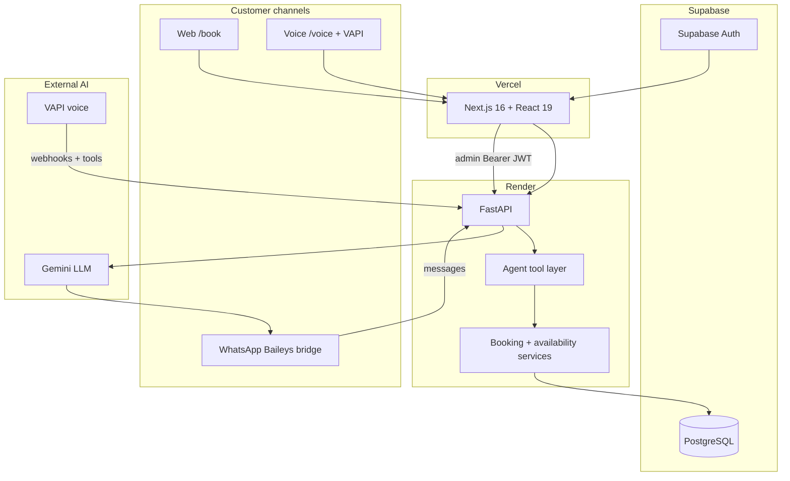

# Sparkle Car Wash — AI Receptionist & Multi-Channel Booking Platform

[](https://car-wash-booking-voice-agent.vercel.app)
[](https://car-wash-booking-voice-agent.onrender.com/health)
[](https://www.python.org/)
[](https://fastapi.tiangolo.com/)
[](https://nextjs.org/)
[](https://react.dev/)
[](https://www.postgresql.org/)
[](https://ai.google.dev/)
[](https://vapi.ai/)
[](https://github.com/WhiskeySockets/Baileys)
[](#engineering-highlights)
[](https://github.com/MTahaFarrukh/Car-Wash-Booking-Voice-Agent)

**One booking engine. Three customer channels. One admin dashboard.**

Sparkle Car Wash is a full-stack **agentic booking platform**: customers can book, reschedule, and cancel car washes via **web**, **voice AI** (VAPI), or **WhatsApp** (Gemini + tool calling). Every channel hits the same FastAPI backend, PostgreSQL database, and availability engine — no duplicate booking logic.

Built as a production-style monorepo with deployed frontend/API, Supabase admin auth, Alembic migrations, and 160+ automated backend tests.

---

## Live demo

| Surface | URL |
|--------|-----|
| **Public site** | https://car-wash-booking-voice-agent.vercel.app |
| **Book online** | https://car-wash-booking-voice-agent.vercel.app/book |
| **Voice AI (browser)** | https://car-wash-booking-voice-agent.vercel.app/voice |
| **Admin login** | https://car-wash-booking-voice-agent.vercel.app/admin/login |
| **API health** | https://car-wash-booking-voice-agent.onrender.com/health |
| **OpenAPI docs** | https://car-wash-booking-voice-agent.onrender.com/docs |

> **Try it in 60 seconds:** open **Book** → pick a service, date, and slot → confirm. Then open **Admin** (seeded Supabase user) and see the same booking on the dashboard.

### Demo / video prep (recommended)

Your production DB may contain **hundreds of seed bookings**, which makes a new demo booking hard to spot in admin. Before recording LinkedIn or a walkthrough:

```powershell
cd backend
.\venv\Scripts\activate
# Wipes bookings, customers, vehicles, call logs — keeps services + admin_users
python -m scripts.reset_demo_data --confirm
```

Then: book once on `/book` → refresh **Admin → Bookings** — you should see exactly that row.

Use `--reseed` only if you want sample catalog data back after the wipe (adds seed customers/bookings again).

---

## Why this project stands out

Most “AI booking” demos are a chat UI glued to a spreadsheet. Sparkle is closer to a **real operations product**:

- **Multi-channel by design** — web, voice, and WhatsApp are adapters on one domain layer, not three separate apps.
- **Tool-calling agents** — Gemini and VAPI assistants call the same Phase 5 booking tools (`check_availability`, `create_booking`, etc.) that power the REST API.
- **Deployed stack** — Next.js on Vercel, FastAPI on Render, Postgres + Auth on Supabase (not localhost-only).
- **Secured admin** — Supabase JWT + `admin_users` table; public booking routes stay open.
- **Tested backend** — booking rules, slot engine, voice/WhatsApp agents, admin auth, and provider adapters covered by pytest.

---

## Architecture



**Design principle:** channels never write SQL directly. They call **tools** → **services** → **database**.

---

## What's built

| Capability | Status | Notes |
|------------|--------|--------|
| Services, slots, create / reschedule / cancel | ✅ | Single `BookingService` + slot engine |
| Public web booking wizard | ✅ | Live on Vercel |
| Admin dashboard (bookings, customers, calls, WhatsApp) | ✅ | Supabase auth + protected `/api/admin/*` |
| Voice booking (VAPI + browser) | ✅ | Server URL → Render; tool-calling verified |
| WhatsApp agent (Gemini + tools) | ✅ | Bridge runs locally; prod host TBD |
| Shared agent tool layer (Phase 5) | ✅ | WhatsApp, voice, and LLM tests share it |
| Alembic migrations + seed data | ✅ | |
| Production deploy (Vercel + Render) | ✅ | See [`DEPLOYMENT.md`](DEPLOYMENT.md) |
| Baileys always-on hosting | ⏳ | Documented; skipped for now |

Booking sources: `dashboard` (web), `voice`, `whatsapp` — all visible in admin.

---

## Engineering highlights

- **164+ pytest tests** — API routers, booking integration, slot engine, WhatsApp/Voice agents, Gemini provider, admin auth.
- **Provider pattern for voice** — VAPI, Uplift, and fake providers behind one normalized webhook pipeline.
- **LLM abstraction** — Gemini (default), OpenAI-compatible, rule-based fallback for WhatsApp.
- **Supabase SSR admin auth** — cookie-backed sessions; middleware/proxy gate on `/admin`.
- **CORS + env hygiene** — production origins only; service-role key never in frontend.
- **Idempotent agent tools** — duplicate booking detection, availability checks before commit.

---

## Tech stack

| Layer | Technologies |
|-------|----------------|
| **Frontend** | Next.js 16, React 19, Tailwind, Supabase SSR |
| **Backend** | FastAPI, SQLAlchemy 2, Alembic, Pydantic v2 |
| **Database** | PostgreSQL (Supabase) |
| **Auth** | Supabase Auth + `admin_users` authorization |
| **Voice** | VAPI (web + phone tools), optional Uplift |
| **WhatsApp** | Baileys bridge, Gemini tool-calling |
| **Deploy** | Vercel (frontend), Render (API) |

---

## Repo layout

```
carwash-booking/
├── backend/           # FastAPI, domain, agents, Alembic, tests
│   ├── app/agent/     # Shared booking tools (Phase 5)
│   ├── app/whatsapp/  # Gemini WhatsApp agent
│   ├── app/voice/     # VAPI / Uplift voice adapters
│   └── app/routers/   # Public + admin HTTP API
├── frontend/          # Next.js public site + admin
├── whatsapp-bridge/   # Baileys → backend transport
├── render.yaml        # Render blueprint
├── DEPLOYMENT.md      # Production URLs & ops notes
└── run.txt            # Local dev (Windows PowerShell)
```

Channel docs: [`backend/app/voice/README.md`](backend/app/voice/README.md) · [`backend/app/whatsapp/README.md`](backend/app/whatsapp/README.md) · [`whatsapp-bridge/README.md`](whatsapp-bridge/README.md)

---

## Quick start (local)

### 1. Environment

```powershell
copy .env.example .env
copy frontend\.env.local.example frontend\.env.local
```

Set `DATABASE_URL` (local Postgres or Supabase). See [`.env.example`](.env.example) for WhatsApp, Gemini, and VAPI keys.

### 2. Backend

```powershell
cd backend
python -m venv venv
.\venv\Scripts\activate
pip install -r requirements.txt
alembic upgrade head
python -m scripts.seed
uvicorn app.main:app --reload --host 127.0.0.1 --port 8000
```

### 3. Frontend

```powershell
cd frontend
npm install
npm run dev
```

Open http://localhost:3000 — **Book** · **Voice** · **Admin**

Full multi-terminal setup (WhatsApp bridge, ngrok): [`run.txt`](run.txt)

### 4. Tests

```powershell
cd backend
.\venv\Scripts\activate
pytest -q
```

---

## Channels

### Web

`/book` — customer wizard (service → vehicle → slot → confirm). Bookings land in admin immediately.

### Voice (VAPI)

- **Production:** assistant Server URL → `https://car-wash-booking-voice-agent.onrender.com/api/voice/vapi/webhook`
- **Browser:** `/voice` uses `@vapi-ai/web` + public key (enter mobile number before calling)
- Tools: `save_booking`, availability, services — mapped to Phase 5 tools

### WhatsApp

1. Start backend + `whatsapp-bridge`
2. Scan QR once (`auth_info/` persists session)
3. Requires `GEMINI_API_KEY`, `WHATSAPP_BRIDGE_SECRET`, `WHATSAPP_AGENT_MODE=auto`

---

## Admin

- Login: `/admin/login` (Supabase email/password)
- Protected APIs: `Authorization: Bearer <access_token>` + row in `admin_users`
- Sections: dashboard, bookings, customers, vehicles, services, availability, calls, WhatsApp activity, settings

Bootstrap: create user in Supabase Auth → `python -m scripts.seed_admin --email … --auth-user-id …`

---

## Author

**Muhammad Taha Farrukh**  
[GitHub](https://github.com/MTahaFarrukh/Car-Wash-Booking-Voice-Agent) · [Live demo](https://car-wash-booking-voice-agent.vercel.app)

---

## License

Private course / portfolio project — not for public redistribution.
